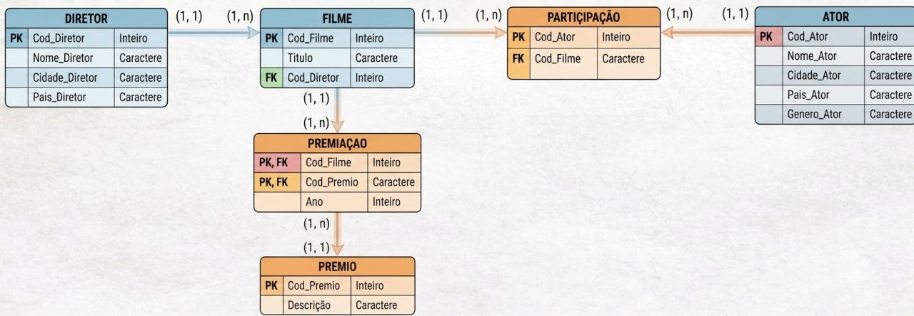
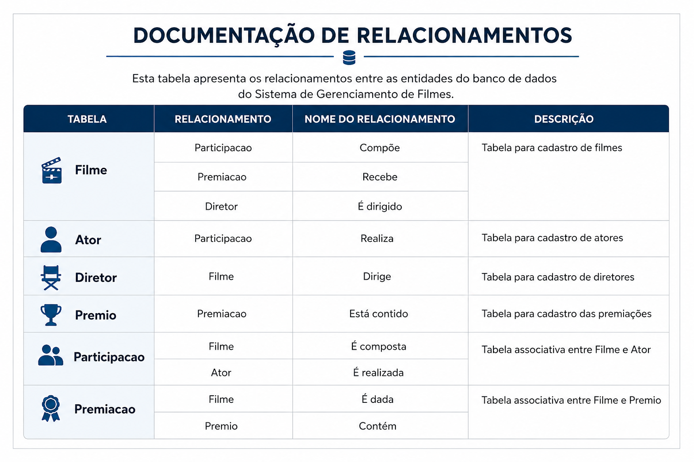

# Projeto de Banco de Dados Relacional - Oracle SQL

## 📌 Sobre o projeto
Projeto completo de modelagem de banco de dados simulando um sistema de controle de filmes, incluindo atores, diretores e premiações.

O projeto percorre todas as etapas de um ciclo real de desenvolvimento de banco de dados, desde a modelagem até a implementação no Oracle Database.

## 🧱 Etapas do projeto

- Levantamento de requisitos
- Modelagem conceitual (Entidades e Relacionamentos)
- Diagrama Entidade-Relacionamento (DER)
- Modelagem lógica e normalização
- Implementação física no Oracle SQL
- Definição de PK, FK e constraints
- Testes de integridade referencial

## 🗂️ Estrutura do repositório

- dicionario_de_dados/ → Documentação 
- imagens/ → DER e modelagem visual
- scripts/ → Scripts SQL Oracle

## ⚙️ Tecnologias utilizadas

- Oracle Database
- SQL
- Git / GitHub

## 🚀 Objetivo
Demonstrar conhecimento completo em modelagem de banco de dados relacional, com foco em estrutura, integridade e boas práticas.

## 🖼️ Modelagem do Banco de Dados

### Modelo Lógico

  

### Relacionamentos (DER)

  

## 📎 Observação
Este projeto inclui modelagem conceitual, lógica e física, além de testes de integridade realizados no Oracle SQL.

## 👩‍💻 Autora
Júlia Fernandes
